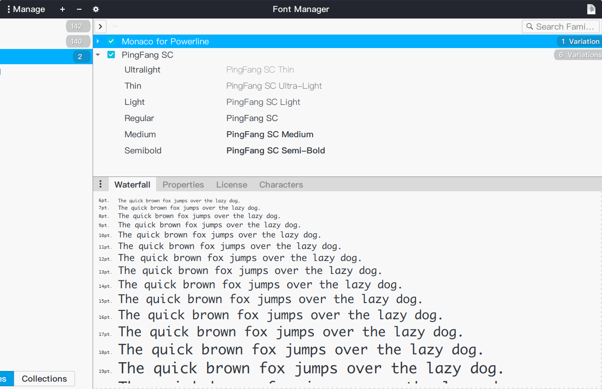

Easy-to-use OTF format PingFang font family, working perfectly on Ubuntu19.04. 
Installing all OTF files with ubuntu fonts application and then we're done. 
SC is the Simplified Chinese version and HK is the Hongkong Traditional Chinese version.

Result in Font Manager app.

